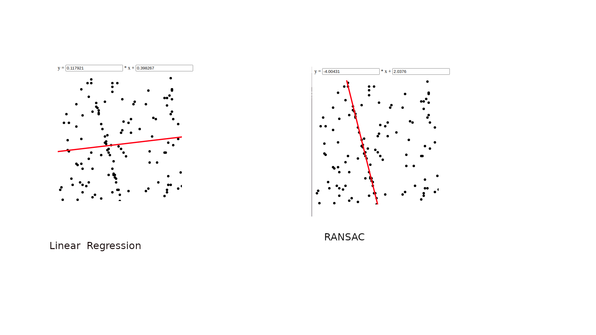

### Vitibot - Test technique ingénieur développement robotique

Quelques règles :

- Timing : tu n'as pas de limite de temps

- Les exercices sont indépendants, on te demande de faire un workspace par exercice

- Langage de programmation: C++

- Organise ton workspace avec les dossiers `src`, `include` et `bin`, et utilise `CMake` pour compiler ton projet (`CMakeLists.txt`)

- Utilise le contrôle de version dans votre développement (Git) et partage avec nous le projet avec le dossier `./git` afin de pouvoir vérifier ton processus de développement (branches, historique des commits, etc.)

Pour tester ton programme, tu utiliseras les _inputsX.txt_ en entrée _stdin_ comme cela :
`./main < input1.txt` par exemple.

Tu peux aussi faire une lecture du fichier passé en paramètre comme cela :
'./main input1.txt' par exemple.

On t'épargne la gestion des éventuelles erreurs de droits d'accès ou de fichier inexistant.

La sortie se fera sur _stdout_.

Si tu as des questions concernant le test, n'hésite pas à nous envoyer un mail :

- Guillermo : guillermo.herrera@vitibot.fr

Bonne chance !

##################################################

My Response

Task1:
- Ordering the obstacle as appearing on the spanig of a 2 d Lidar
- workspace: radar_ws
- executable name: radar_span_obstacle
- usage: 
    - cd to bin folder
    - ./radar_span_obstacle <filename>

Task2:
- Linear regression and one algorithm to implement
- workspace: regression_ws
- executables name: There are two executables. 
    - ./regression_node -> It is a simple linear regression and done for the purpose of    practice.  
    - ./ransac_node -> this is the main executable which implements the algorithm

- usage: 
    - cd to bin folder
    - ./ransac_node <filename>

##################################################

Answers to Theoretical Quesions:

##### c) Complexité

En considérant que le calcul du modèle et de l'erreur sont en O(1), quelle est la complexité de ton implémentation de l'algorithme, en fonction de N le nombre de points et K le nombre d'itérations ?

O(k*(N+ N + (N-n) + N +N) = O(k*(5N -n))

##### d) Bonus

Connais-tu le nom de l'algorithme que tu as implémenté ?

Yes, The algorithm seems to me is RANSAC. It is used to find the outliers in a set of data points with respect to a given model (geometrical). Very often it is used in robotics SLAM algorithm to detect lines or find some patterns in a 3d point clouds. It is also a useful tool in feature association where wrongly associated feature points (outliers) can be filtered out.

##### e) Bonus 2

Sachant que le nombre de points valides pour le modèle recherché représente `p`% des points.
Sachant qu'on prend aléatoirement `n` points à chaque itération et qu'il y a `k` itérations.
Quelle est la probabilité de ne pas tomber sur `n` points du modèle après `k` itérations ?
Par extension, exprime le nombre d'itérations `k` idéal pour qu'il y ait au moins 99% de probabilité pour tomber au
moins une fois sur `n` points du modèle.
Applique la formule pour `n = 2` et `p = 23%` et donne le résultat.

k >= log(1 - confidence)/log(1 - p^n)

where, confidence is given as 99% (0.99).
and p = 0.23;

The above relation gives the minmum number of k iterations needed.
k = 84.7308. 
So is this the reason why k = 85 given as the defaul in the question?

Thanks!
